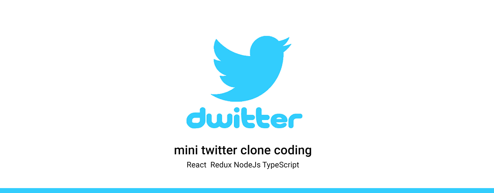
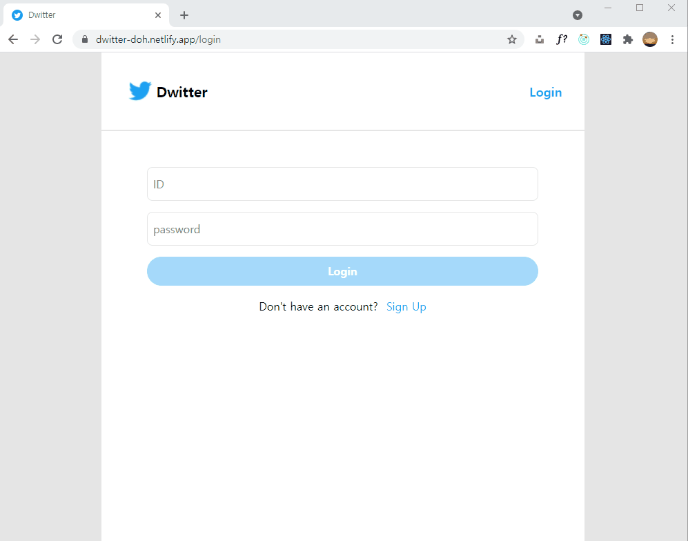

# Dwitter - twitter clone coding

## 1. Introduction

**Dwitter**는 TypeScript, React, NodeJs, MySQL을 활용하여 트위터의 기본 기능을 클론 코딩한 프로젝트입니다.

### 프로젝트 기간

- 2021.07.01 -

### 담당 분야

- 개인 프로젝트

### preview



## 2.Features

- 노트북 화면 사이즈를 중심으로 한 반응형 스타일링

- 이메일 주소로 간편한 회원가입 구현

- 드윗 작성/편집/삭제 기능
- 특정 회원의 드윗 모아보기 기능 구현

## 3. Requirements

- 최신 Chrome 브라우저의 사용을 권장합니다.

## 4. 사용 스킬

### 1) Client

- React
- React Router
- Redux
- Redux-saga
- PostCSS

### 2) Server

- TypeScript
- Node.js
- Express
- MySQL
- JSON Web Token
- bcrypt

### 3) Deployment

- Client:
- Server:

## 5. Installation

### Client

1. git을 클론합니다.

```
git clone https://github.com/web-doh/dwitter-client.git
cd dwitter-client/
```

2. `.env` 파일을 생성하고 아래 `<>`에 환경변수를 입력한 후, root 디렉토리에 저장합니다.

```
REACT_APP_BASE_URL=http://localhost:8080
```

3. 패키지 관리 툴로 필요한 라이브러리들을 설치합니다.

```
yarn install
yarn start
```

### Server

1. git을 클론합니다.

```
git clone https://github.com/web-doh/dwitter-server.git
cd dwitter-server/
```

2. `.env` 파일을 생성하고 아래 `<>`에 환경변수를 입력한 후, root 디렉토리에 저장합니다.

```
JWT_SECRET_KEY=<jwt-secret-key>
JWT_EXPIRES=<숫자 + d 형식으로 작성>
BCRYPT_SALT_ROUNDS=<bycrypt-salt-round>
DB_HOST=localhost
DB_USER=<db-user>
DB_DATABASE=<db-database>
DB_PASSWORD=<db-password>
CORS_ALLOW_ORIGIN=http://localhost:3000
CSRF_SECRET_KEY=<csrf-secret-key>
```

3. 패키지 관리 툴로 필요한 라이브러리들을 설치합니다.

```
yarn install
yarn start
```

## 6. 프로젝트 관리 툴

- 업무 관리, API 작성 및 오류 노트 작성 : Notion

- 코드 버전 관리 : Git / Github Desktop

## 7. Challenges

본 프로젝트를 진행하면서 겪었던 기술적 어려움들은 아래와 같습니다.

### 1) Redux와 Redux-saga 활용

-

## 8. Things to do

### 1) 추가하고자 하는 기능

- Socket.io를 활용하여 실시간 채팅 지원
