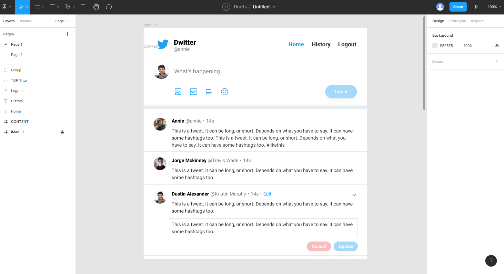
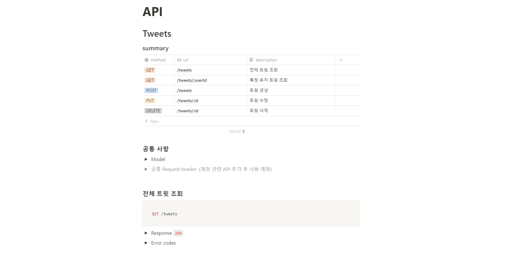

# Dwitter - twitter clone coding

## 1. Introduction

**Dwitter**는 가입자끼리 짧은 글을 실시간으로 주고 받을 수 있는 트위터의 기본 기능을 구현한 웹 어플리케이션 입니다. 클론 코딩을 하면서 Redux와 Redux-saga의 원리를 익히고, TypeScript와 NodeJs를 응용하는 방법을 익히고자 했습니다.

### 프로젝트 기간

- 2021.07.01 -

### preview


## 2.Features

- 노트북 화면 사이즈를 중심으로 한 반응형 스타일링

- 이메일 주소로 간편한 회원가입 구현
- HTTPOnly 쿠키와 csrf 토큰(커스텀 헤더 활용)으로 보안 강화

- 드윗 작성/편집/삭제 기능
- 특정 회원의 드윗 모아보기 기능
- 다른 회원이 새로운 드윗을 올리면 팝업으로 알려주는 기능

- rate limiting 처리를 통해 서버 보호

## 3. Requirements

- 최신 Chrome 브라우저의 사용을 권장합니다.

## 4. 사용 스킬

### 1) Client

- React
- React Router
- Redux
- Redux-saga
- axios
- axios-retry
- PostCSS

### 2) Server

- TypeScript
- Node.js
- Express
- MySQL (로컬)
- Sequelize & PostgreSQL (배포)
- JSON Web Token
- bcrypt
- express-rate-limit

### 3) Deployment

- Client: https://dwitter-doh.netlify.app (netlify)
- Server: https://dwitter-doh.heroku.app (heroku)

## 5. Installation

### Client

1. git을 클론합니다.

```
git clone https://github.com/web-doh/dwitter-client.git
cd dwitter-client/
```

2. `.env` 파일을 생성하고 아래 `<>`에 환경변수를 입력한 후, root 디렉토리에 저장합니다.

```
REACT_APP_BASE_URL=http://localhost:8080
```

3. 패키지 관리 툴로 필요한 라이브러리들을 설치합니다.

```
yarn install
yarn start
```

### Server

1. git을 클론합니다.

```
git clone https://github.com/web-doh/dwitter-server.git
cd dwitter-server/
```

2. `.env` 파일을 생성하고 아래 `<>`에 환경변수를 입력한 후, root 디렉토리에 저장합니다.

```
JWT_SECRET_KEY=<jwt-secret-key>
JWT_EXPIRES=<숫자 + d 형식으로 작성>
BCRYPT_SALT_ROUNDS=<bycrypt-salt-round>
DB_HOST=localhost
DB_USER=<db-user>
DB_DATABASE=<db-database>
DB_PASSWORD=<db-password>
CORS_ALLOW_ORIGIN=http://localhost:3000
CSRF_SECRET_KEY=<csrf-secret-key>
```

3. 패키지 관리 툴로 필요한 라이브러리들을 설치합니다.

```
yarn install
yarn start
```

## 6. 프로젝트 관리 툴

- 와이어프레임 설계 : Figma
  

- 업무 관리, API 작성 및 오류 노트 작성 : Notion
  

- 코드 버전 관리 : Git / Github Desktop

## 7. Challenges

본 프로젝트를 진행하면서 도전한 내용입니다.

### 1) Redux와 Redux-saga

Redux를 적용하면서 가장 어려웠던 것은 직관적이지 않은 함수와 변수 명, 그리고 복잡한 파일 구성이었기 때문에 스스로 헷갈리지 않고 관리할 수 있도록 ducks 패턴을 활용했습니다. 하지만 아직 Redux가 익숙하지 않아서 실시간으로 새로운 트윗을 알림 받기 위해 Socket.io를 활용할 때 불필요한 네트워크 요청이 반복되도록 작성했습니다. 이 부분은 앞으로 더 수정해나갈 계획입니다.

### 2) TypeScript

- 함수 반환 타입 지정<br/>
  함수에 반환되는 타입을 지정할 때 잘못된 타입을 적어 예상치 못한 에러가 많이 발생했습니다. 라이브러리의 함수는 d.ts 파일을 활용하거나 타입 강제 등을 통해 해결했고, 그 외의 함수는 type alias나 union types로 새로운 타입을 지정하여 해결했습니다. 하지만 그럼에도 해결되지 않는 에러는 any 타입을 지정해서 해결했습니다.

- OOP 구현<br/>
  TypeScript 강좌를 들으며 익혔던 interface를 사용한 디커플링이나 싱글톤 패턴 등을 활용하고자 시도했습니다.

### 3) 기능 분리

기능별로 파일을 분리하여 작성해서 한 가지 기능을 담당하는 곳에서는 해당 기능에만 집중하여 작성할 수 있도록 작성하고자 했습니다.

- MVC 패턴 적용 <br/>
  기능별로 파일을 분리하여 유지보수에 편할 수 있도록 서버와 클라이언트 모두 MVC 패턴을 적용하여 작성했습니다.

- 자주 쓰이는 기능 분리<br/>
  양식을 제출할 때 쓰이는 로직이나 네트워크 통신과 관련된 함수, 그 외 반복적으로 사용되는 util 함수 등을 하나의 모듈로 분리하여 작성하고자 했습니다.

- config 파일 분리<br/>
  설정 값 관리를 편리하게 할 수 있도록 .env 파일에 적용한 환경 변수를 config.ts 파일에서 import 하는 방식으로 작성했습니다. 변수가 지정되지 않았을 경우를 대비하여 기본 값을 지정할 수 있도록 required 함수를 만들어 활용했습니다.

- css-module 활용<br/>
  파일 간 클래스가 중첩되지 않아 컴포넌트 별로 간편하게 이름을 지을 수 있기 때문에 사용했습니다. 또한 postcss-modules-values 플러그인을 활용해서 자주 쓰이는 사이즈나 컬러 등을 따로 관리할 수 있도록 작성했습니다.

## 8. 느낀점

기능을 분리하는 것에 신경써서 구현하고자 했지만 높은 수준으로 구현하지 못했고, Redux의 사용법 익히기를 선순위로 두고 작업을 하다보니 놓친 부분이 많다고 생각합니다. 하지만 TypeScript나 Redux의 기초적인 활용 방법을 익힐 수 있었고, OOP와 TypeScript를 활용한 개발에 필요한 기반을 다질 수 있었습니다.

## 9. Things to do

- 회원 정보 수정 및 탈퇴 기능 추가
- 유저 팔로우 기능 추가
- 새로운 드윗 팝업 알림시 window.confirm 대신 custom 팝업 창으로 변경
  - 알림 아이콘으로 알림 표시 기능
- 리팩토링
  - socket.io와 Redux-saga eventChannel 활용 등
